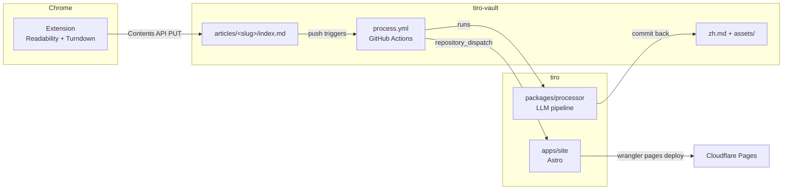

# Tiro Architecture

Tiro is a personal read-it-later tool and external knowledge base. Code lives in
this monorepo (`tiro`); content lives in a separate vault repo (`tiro-vault`).

## Data flow

1. **Clip.** The Chrome extension extracts the current page (Readability),
   converts it to Markdown (Turndown), assembles frontmatter, and commits a
   single `index.md` into the vault via the GitHub Contents API. Images stay
   hotlinked (absolute URLs) at this stage.
2. **Process.** A push to `articles/**` triggers the vault's workflow, which
   checks out this repo and runs `tiro-process`:
   - detect language (CJK-codepoint ratio, no LLM call),
   - download images into `assets/` and rewrite body URLs to relative paths
     (per-image fallback to hotlink on failure),
   - one LLM call for a structured summary, one category (from the taxonomy in
     `config/tiro.yml`), and free-form tags, written into frontmatter,
   - for non-Chinese articles, a block-aligned Chinese translation → `zh.md`,
   - commit results back and fire a `repository_dispatch` to this repo.
3. **Publish.** The deploy workflow checks out both repos, builds the Astro
   site from the vault content, indexes it with Pagefind, and deploys to
   Cloudflare Pages. The site is fully public.

## The content contract

`packages/shared` is the single source of truth shared by all three
components: frontmatter schema (Zod), slug/path rules, block-alignment
helpers, and the `tiro.yml` config schema. Key invariants:

- **Slug is deterministic from the URL** (normalized URL → slugified
  host+path + 8-hex SHA-256 suffix). Articles live flat at
  `articles/<slug>/` (ADR 0007), so the path itself guarantees a re-clip
  overwrites the same article and reprocesses it.
- **Needs processing** = frontmatter lacks `tiro.processed_at`. Idempotent and
  retry-safe; no dependence on push diffs.
- **Translation alignment**: `zh.md` has strict 1:1 top-level-block alignment
  with the `index.md` body (code blocks byte-identical). The site zips the two
  block arrays for side-by-side rendering; misalignment falls back to stacked
  rendering, and the processor never writes a misaligned `zh.md`.
- **LLM access is provider-configurable**: an OpenAI-compatible
  chat-completions endpoint configured in `config/tiro.yml` (`base_url`,
  `model`, `api_key_env`). Default: Aliyun Bailian + `qwen-plus`.

## Repositories and credentials

| Where | Secret / token | Purpose |
| --- | --- | --- |
| Extension options page | fine-grained PAT (tiro-vault, Contents RW) | clip commits |
| tiro-vault Actions | `TIRO_LLM_API_KEY` | LLM calls |
| tiro-vault Actions | `TIRO_DISPATCH_TOKEN` (tiro, Contents RW) | repository_dispatch |
| tiro Actions | `VAULT_READ_TOKEN` (tiro-vault, Contents R; only if vault is private) | deploy checkout |
| tiro Actions | `CLOUDFLARE_API_TOKEN`, `CLOUDFLARE_ACCOUNT_ID` | Pages deploy |

## Risk register

- **Silently empty Astro collection** when the vault path is wrong
  (withastro/astro#12795): the site asserts the vault dir exists and fails the
  build if the articles collection is empty.
- **`btoa` throws on non-Latin1** (Chinese titles): the extension encodes
  base64 via a chunked `TextEncoder` helper.
- **Readability returns `null`** on SPAs/paywalls: fall back to capturing
  `document.body` with a `readability_failed` frontmatter flag.
- **Hotlink-protected or oversized images**: per-image fallback to the
  original URL; an image failure never fails the article. Stage-wide caps
  (`images.max_count`, `total_max_bytes`, `stage_timeout_ms`) stop an
  image-heavy page from running the job past its `timeout-minutes`.
- **Contents API 1MB GET limit** breaks the sha lookup for very large clips:
  `findExistingIndex` is a single Contents GET, so re-clipping a page whose
  stored `index.md` exceeds 1MB fails the clip rather than overwriting. Not
  mitigated — a Markdown clip that large is not a case worth code. (A Git
  Trees fallback would be the fix if it ever happens.)
- **Workflow recursion**: pushes made with the default `GITHUB_TOKEN` do not
  retrigger workflows; the processing workflow also uses a concurrency group
  and rebase-retry pushes.
- **Expiring fine-grained PATs** (two of them): documented in the
  vault-template README; set a calendar reminder.
- **Pagefind index only exists after a build**: the search UI degrades
  gracefully in `astro dev`.
- **Cloudflare Pages 25MB/file cap**: the asset copy step skips and warns on
  oversized files (the processor already caps downloads at 10MB).

## Decision log

See [`docs/adr/`](./adr/) for the individual decision records.
