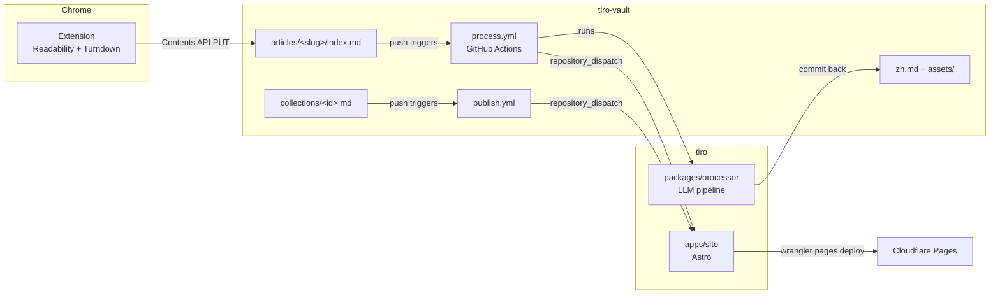

# Tiro Architecture

Tiro is a personal read-it-later tool and external knowledge base. Code lives in
this monorepo (`tiro`); content lives in a separate vault repo (`tiro-vault`).

## Data flow

1. **Clip.** The Chrome extension repairs the page DOM, extracts it
   (Readability), converts it to Markdown (Turndown), assembles frontmatter,
   and commits a single `index.md` into the vault via the GitHub Contents API.
   Images stay hotlinked (absolute URLs) at this stage.

   Two kinds of page are not read from the tab at all, for one reason: their
   publisher's URL forms are a single identity (ADR 0013), so a clip does not
   *add* an article but replaces one — and the body in the tab is the lesser of
   the two. Both are fetched under an optional host permission requested from
   the Clip button's own user gesture, and record `tiro.source_url`. The popup
   holds them behind one `FetchableSource` descriptor, and the rule for choosing
   between a fetched body and the tab's lives in `clip-candidate.ts`: prefer the
   body that *is* the document, and gate the Clip button until that is settled.

   - **An arXiv paper.** The popup fetches `arxiv.org/html/<id>`, falling back
     to the abstract page when arXiv has no usable HTML (a `\includepdf`
     submission renders as a stub arXiv still serves with HTTP 200). A fetched
     document is given a `<base>` and has its `src`/`href` attributes rewritten
     before extraction: Readability absolutizes against `doc.baseURI`, which for
     a `DOMParser` document is the popup's URL, and the processor downloads only
     `https?://` URLs — so without it every figure would vanish without an error
     anywhere.
   - **A markdown file on GitHub.** A `github.com/<owner>/<repo>/blob/…/*.md`
     page is a *rendering* of the file, and its "Code" tab is worse — the source
     sits in a virtualized container holding only the lines scrolled into view.
     The popup fetches the bytes from `raw.githubusercontent.com` instead
     (ADR 0023). Nothing is fetched when the reader is already on the raw URL:
     the tab holds the file and `activeTab` covers reading it.

   A PDF on this computer is imported from the **options page** instead
   (ADR 0027). The extension reads its layout there — font, size and position
   per run of text, not merely the characters — a file picker needs
   no permission, and pdf.js is loaded lazily so Settings does not pay 1.6 MB
   to be opened — applies the page and scan gates while there is still a person
   to tell, and commits the text with its pages separated. The document is
   filed under `local:<filename>`, carries the `"local"` domain sentinel, and
   starts unlisted. Where the layout reads cleanly the import commits finished
   Markdown and no model is ever involved (ADR 0028). Nothing binary enters the
   vault on either path.

   A PDF served to the tab itself is clipped as a **stub** — identity and title,
   no body — and the body is built later by the processor from the document's
   text layer (ADR 0026). The extension never reads the PDF: Chrome renders it
   in a plugin the DOM cannot see, so `isPdfViewerDocument` detects the viewer
   by shape and the popup commits the URL instead. Where a publisher offers an
   HTML twin the offer above wins and no stub is written, because stubbing an
   arXiv PDF would file the lesser body under the paper's own slug.

   A markdown file is the one document the pipeline below does not touch. Chrome
   renders `text/plain` as a shell whose body is one `<pre>`, which the clipper
   used to convert into a single fence around the whole document — untranslatable
   by contract, titled after the hostname, and with every repo-relative image
   left pointing at the site's own origin. The file is already markdown, so
   `clipPage` branches before any of the repair below: the body is carried
   verbatim, relative destinations are resolved against the URL the bytes came
   from, reference-style links are inlined so each top-level block still renders
   standalone, and the title comes from the file's own frontmatter or its first
   heading (ADR 0023). Detection is structural — the body is exactly one `<pre>`
   holding all of the document's text — so GitLab, Codeberg and any static `.md`
   are covered without a hostname.

   The repair pass (`apps/extension/src/dom-prepare.ts`) runs on a clone
   *before* Readability, which prunes low-text subtrees it cannot be asked to
   give back. It recovers each formula's LaTeX source (KaTeX/MathJax
   annotation, then arXiv's `<math alttext>`, then MathJax v2's
   `math/tex` script), deletes the visual duplicate, escapes literal dollars so
   the recovered delimiters are the only bare ones left, and records `has_math`;
   and it normalizes however the page marked up its code languages into the
   `language-*` class Turndown reads, dropping line-number gutters (ADR 0009).
   When a page marks up no language at all — the Shiki-rendered case, now
   common on docs sites and engineering blogs — it falls back to the chrome
   around the block: a tab strip's selected tab, a header naming a file. That
   text is resolved through an allowlist and never a pattern, because `Copy`
   and `Output` sit exactly where a language name sits (ADR 0012).
   It also clears the class tokens that make Readability delete a code block:
   that judgement is made on an element's class name before it looks at what the
   element holds, and Tailwind's `overflow-hidden` and `code-block-scroll`
   collide with the regex that decides. Only the colliding token is removed —
   the element and every other class stay, so Readability keeps reaching its own
   verdicts rather than having them re-derived here (contrast the gallery
   wrapper, which is unwrapped and therefore needs an allow-list).

   Two things then have to survive Readability, and only one of them can travel
   as itself. Readability strips `class` from everything it returns, so a
   recovered formula and a recovered code language both cross on a `data-tiro-*`
   attribute and are turned back into markdown-bearing shapes afterwards — the
   formula by a Turndown rule, the language by having its class restored in
   `clip-page.ts`. Anything computed before extraction has to ride a `data-*`
   attribute to get past it.

   Figures are the other post-extraction step, folded *after* it instead: a `<figure>`'s
   caption joins its image's paragraph, so the two arrive as one block and the
   site can render them as a figure — co-location is the only association
   markdown can express (ADR 0011). It has to run second because Readability
   selects on the very attributes folding replaces; done first, a
   `<figure hidden>` became a plain `
` and its hidden image was published.
2. **Process.** A push to `articles/**` triggers the vault's workflow, which
   checks out this repo and runs `tiro-process`:
   - for a PDF (`tiro.source_media: "pdf"`), build the body first. A web PDF is
     fetched under the same guards the image stage uses and read structurally:
     where its typography carries a heading hierarchy or a fixed-width face,
     the Markdown is built from that and **no model is called at all** (ADR
     0028). Only a document with nothing to read falls back to the flat text
     and the structure pass. An imported one arrives with all of this already
     done, or, where it did not read cleanly, with the flat text and the pass
     still owed — the branch is taken from the URL scheme, since `local:`
     cannot be fetched (ADR 0027). Where the model does run it is asked to
     restore Markdown structure — checking each reply kept its content and
     rebuilt no tables, and keeping the extracted text where it did not
     (ADR 0026). A refusal leaves the article pending, so nothing is re-clipped,
   - detect language (CJK-codepoint ratio, no LLM call),
   - download images into `assets/` and rewrite body URLs to relative paths
     (per-image fallback to hotlink on failure),
   - one LLM call for a structured summary, one category (from the taxonomy in
     `config/tiro.yml`), and free-form tags, written into frontmatter — and, for
     an article not already in the target language, the title translated into it
     and the summary written a second time in the article's own language. One
     call, so a title and the summary it renders under agree on their terms
     (ADR 0016),
   - for non-Chinese articles, a block-aligned Chinese translation → `zh.md`,
     batched and checkpointed so a long article resumes rather than restarts
     (ADR 0008),
   - commit results back and fire a `repository_dispatch` to this repo —
     after every push and manual run, committed or not, so a hand edit to the
     vault publishes itself (ADR 0032).

   Pending articles are processed cheapest-first, under a wall-clock budget
   (`processing.run_budget_ms`) the processor enforces itself so it stops in
   time to commit. Anything it does not reach stays pending for the next run.
3. **Publish.** The deploy workflow checks out both repos, builds the Astro
   site from the vault content, indexes it with Pagefind, and deploys to
   Cloudflare Pages. The site is fully public.

   The site's shape follows the "Later Reader" design (ADR 0014): a paginated
   Library at `/` and `/page/N/`, a 搜索与标签 page carrying Pagefind search
   plus every tag as a chip (`/tags/` redirects to it — `astro.config.mjs`
   for dev and the static fallback, `public/_redirects` for Cloudflare's
   edge; categories are reached from each article, ADR 0031), the reader, and a settings
   page. Reading preferences — paper, text size, default layout, list view —
   live in the browser's `localStorage` and are applied by an inline script
   before first paint; nothing about a reader ever reaches the server.
   Reading time and the status pill are derived at build time from the
   contract's existing fields (`src/lib/article-meta.ts`). The Chinese title is
   *stored* — `title_zh`, written by the processor (ADR 0016) — with the title
   lifted out of `zh.md` kept as the fallback for articles processed before the
   field existed. That lifted pair still decides one thing on its own: whether
   the body repeats its own title and the reader should skip its first row.

   Rendering is one unified pipeline (`apps/site/src/lib/render.ts`). It parses
   with `remark-cjk-friendly`, as `@tiro/shared` does, so a translation whose
   emphasis touches CJK punctuation renders as emphasis rather than asterisks
   (ADR 0025). Shiki
   and KaTeX run *after* rehype-sanitize, as trusted generators over
   already-scrubbed text, so the allowlist never has to admit the classes and
   inline styles they emit — which would admit them from clipped markup too
   (ADR 0009). One more pass sits between the sanitizer and those generators:
   the sanitizer clobbers `id` to `user-content-…` and leaves `href="#…"` alone,
   so in-document links are reconciled with their targets there — and scoped to
   the pane they render into, since both columns share one document (ADR 0024).

   A fence that still carries no language after the clipper's chain gets one
   inferred from its code at build time (`@tiro/shared`'s `detect-language.ts`),
   on unambiguous
   signatures only. Inference lives here and not in the clipper because a guess
   written into the vault is permanent while a guess made at build time costs
   one build — and because roughly 16 of the vault's 40 fenced blocks are
   English prose that an author fenced for display, so the failure that matters
   is a paragraph painted as Ruby, not a block left plain (ADR 0012).

## The content contract

`packages/shared` is the single source of truth shared by all three
components: frontmatter schema (Zod), slug/path rules, block-alignment
helpers, and the `tiro.yml` config schema. Key invariants:

- **Slug is deterministic from the URL** (normalized URL → slugified
  host+path + 8-hex SHA-256 suffix). Articles live flat at
  `articles/<slug>/` (ADR 0007), so the path itself guarantees a re-clip
  overwrites the same article and reprocesses it.
- **A publisher may define its own identity** (ADR 0013). `canonicalizeUrl`
  runs last in `normalizeUrl` and rewrites a URL to the form its publisher
  declares canonical. Two rules today:
  - **arXiv**, whose `/abs/`, `/pdf/` and `/html/` forms and `v1`/`v2` suffixes
    all name one paper, and whose abstract page says so in its own
    `rel="canonical"`. The rewrite fires only on a known host, a known paper
    route and an exact identifier match, so `/list/cs.AI/recent` stays an
    ordinary page.
  - **GitHub markdown** (ADR 0023), where the raw bytes and the blob page are
    one file and `refs/heads/main` and `main` are one ref. The rewrite carries
    `<ref>/<path>` as an opaque tail and only replaces the prefix, because a
    branch name may contain slashes and nothing offline can say where the ref
    ends. A different ref stays a different article — a tag or SHA is a pin,
    not a variant — and the rule is gated on markdown, because identity is only
    safe to claim where the clipper can read the file.

  `tiro.source_url` records the URL the body was read from when that is not the
  article's own — for arXiv the versioned HTML page, for GitHub the raw file.
  Changing a rule renames existing articles: `validate` detects it,
  `sweep --recanonicalize` repairs it.
- **Short links are derived, not assigned** (ADR 0019). `/s/<id>` redirects to
  `/articles/<slug>/`, where `<id>` is the slug's own 8-hex suffix read back
  out — so there is no registry, nothing in the vault knows short links exist,
  and any component that can compute a slug can compute the link. The long URL
  stays canonical; the aliases carry `noindex` and are filtered out of the
  sitemap. Two articles deriving one id lose it both, rather than one of them
  being reassigned something a later rebuild could resolve differently.
- **Needs processing** = frontmatter lacks `tiro.processed_at`. Idempotent and
  retry-safe; no dependence on push diffs. Every translated article keeps a
  `.tiro-zh-cache.json` checkpoint beside it: an article too long for one run
  resumes from it (ADR 0008), and a finished one holds onto it so a later
  re-clip pays only for the blocks whose source text changed (ADR 0010). The
  checkpoint is invisible to every reader, which glob `index.md`/`zh.md` only.
- **Translation alignment**: `zh.md` has strict 1:1 top-level-block alignment
  with the `index.md` body (`code` and `math` blocks byte-identical). The site
  zips the two block arrays for side-by-side rendering; misalignment falls back
  to stacked rendering, and the processor never writes a misaligned `zh.md`.
  The shared parser runs remark-math, so `$$…$$` is a single `math` block even
  with blank lines inside, the way a fenced code block already is (ADR 0009).
- **Each article records what produced it**: `tiro.clipper_version` and
  `tiro.clipper_commit` alongside `tiro.processor_version`, all optional so
  articles predating any of them simply lack them. The version names a
  *release*; the commit — `git describe` output injected at build time, e.g.
  `ext-v0.11.0-8-gbe3dcc8` — names the *source* it was built from, which is the
  honest answer when the extension is loaded unpacked from a working tree
  rather than installed from a release. A `-dirty` suffix records that the tree
  differed from that commit without saying how, so two dirty builds off one
  commit are indistinguishable: it narrows an investigation rather than
  settling it. Answering "which clipper wrote this?" per article beats comparing
  `clipped_at` against the extension's git history, which is how the arXiv
  equation regression had to be traced. Note that both must be named on
  `ArticleFrontmatterSchema`, not just the clip schema: zod strips keys an
  object does not name, and the processor reparses and rewrites frontmatter on
  every run, so an unnamed field is deleted the first time an article is
  processed.
- **The translated title is stored, not derived** (ADR 0016): the optional
  `title_zh`, and beside it `summary_orig`, the summary written a second time in
  the article's own language. Both are named on `ArticleFrontmatterSchema` only
  — the inverse of the provenance rule above, and for the inverse reason: the
  processor writes them, so a re-clip *should* drop them. The page's title may
  have changed, and the clip that rewrites `index.md` also clears
  `tiro.processed_at`, so the next run writes them again. Optional and additive,
  so no `tiro.schema` bump.
- **Unlisted articles are kept out of every public index** (ADR 0017): the
  optional `unlisted` flag, set by hand in the vault, keeps an article out of
  the library, the pager, the tag and category pages, the search index, the feed
  and the sitemap, while leaving it built and reachable at its URL. Nothing
  originates it, but it is named on *both* schemas, because both sides rewrite
  frontmatter: the processor spreads it through, and the clipper reads it off
  the article a re-clip is about to overwrite (in the GET that already fetches
  the blob sha) so hiding survives a re-clip. The site is public
  and slugs are deterministic (ADR 0007), so this hides an article from anyone
  browsing, not from anyone who knows the source URL: it is not access control.
  Optional and additive, so no `tiro.schema` bump.
- **Collections are the owner's, not the pipeline's** (ADR 0029). One file per
  collection at `collections/<id>.md`, the filename stem being the id, holding
  an ordered list of member slugs; favorites is the reserved id `favorites`.
  They are the vault's only cross-reference — a collection names articles —
  so `validate` checks every member exists and `sweep --recanonicalize`
  rewrites memberships when it moves a slug. Nothing in the processor sees
  them: every glob it runs is rooted at `articles/`, and a collections push
  triggers the vault's `publish.yml`, which only dispatches a deploy. The site
  joins members through the listed funnel, so an unlisted article stays off a
  public collection page while its own page still shows its chips. A
  collection's cover is derived from its listed members' lead images unless a
  hand-set `cover:` pins one article asset by vault path (ADR 0030); `validate`
  checks it exists and is listed, and the sweep carries it across a rename.
  Every page
  carries a `tiro:site` meta and article pages a `#tiro-page` JSON island (slug,
  memberships, catalog), which is how the clipper recognizes a Tiro page on any
  domain.
- **Math is declared, not guessed**: the optional `has_math` flag records that
  the clipper escaped every literal `$` in the article's prose, so every bare
  `$…$` left in it is a formula. Only those articles read `$…$` as a delimiter;
  everywhere else the site renders `$$…$$` alone, so prose dollar amounts are
  never mistaken for formulas. Only the clipper may set it — it is the one
  component that sees the DOM and can tell a price from a formula (ADR 0009).
- **LLM access is provider-configurable**: an OpenAI-compatible
  chat-completions endpoint configured in `config/tiro.yml` (`base_url`,
  `model`, `api_key_env`). Default: Aliyun Bailian + `qwen-plus`.

## Repositories and credentials

| Where | Secret / token | Purpose |
| --- | --- | --- |
| Extension options page | fine-grained PAT (tiro-vault, Contents RW) | clip commits — in `chrome.storage.local`, and in `chrome.storage.sync` too if the user opts into settings sync (ADR 0022) |
| tiro-vault Actions | `TIRO_LLM_API_KEY` | LLM calls |
| tiro-vault Actions | `TIRO_DISPATCH_TOKEN` (tiro, Contents RW) | repository_dispatch, from `process.yml` and `publish.yml` |
| tiro Actions | `VAULT_READ_TOKEN` (tiro-vault, Contents R; only if vault is private) | deploy checkout |
| tiro Actions | `CLOUDFLARE_API_TOKEN`, `CLOUDFLARE_ACCOUNT_ID` | Pages deploy |

## Risk register

- **Silently empty article list** when the vault path is wrong: the site
  asserts the vault dir exists and fails the build if the list is empty. The
  default `fixtures/vault` is found by searching upward rather than by counting
  `..` — the reader is bundled for the build, where a fixed depth pointed at
  `apps/fixtures/vault` and only this guard caught it.
- **A clipped asset that cannot be measured** — a tracking pixel served as a
  dimensionless SVG, say. It used to fail the whole build, because Astro's
  content layer measured every image an article referenced. The site reads the
  vault itself now and serves assets as plain copies, so a bad one costs its own
  image and nothing else (ADR 0020); a fixture holds the line.
- **An imported document cannot be re-read at all.** Its bytes were never in
  the vault and CI cannot reach the disk they came from, so `--force`
  re-restructures the body rather than re-extracting it. Re-importing the file
  is the way to genuinely start over (ADR 0027).
- **A PDF whose source disappears** cannot be reprocessed: unlike a clip, a PDF
  article's body is derived from bytes the vault never stored, so a 404 later
  means the article keeps the Markdown it already has. The same position a
  re-clip of a dead URL is in, and the price of keeping binaries out of the
  vault (ADR 0026).
- **A model that summarizes instead of restructuring** a PDF would be invisible:
  the reply is clean Markdown either way. Each reply is measured against its
  input for retained content and refused for rebuilding tables; a batch that
  fails every attempt keeps the extracted text instead.
- **`btoa` throws on non-Latin1** (Chinese titles): the extension encodes
  base64 via a chunked `TextEncoder` helper.
- **Readability returns `null`** on SPAs/paywalls: fall back to capturing
  `document.body` with a `readability_failed` frontmatter flag.
- **Readability judges content by a regex over class names**, before it looks at
  what an element holds, and ordinary CSS collides with those regexes by
  accident. Three collisions have cost published articles their content:
  `ltx_guessed_headers` matched `header` and deleted arXiv's data tables
  (0.9.0); a CSS-module `…media-gallery` matched `media` and deleted every image
  in a gallery (0.11.0); Tailwind's `overflow-hidden` and `code-block-scroll`
  matched `hidden` and `scroll` and deleted every code block on a docs page
  (0.11.1). The remedy each time is to hand Readability a DOM it judges
  correctly, never to re-derive its rules — see `dom-prepare.ts`. Expect a
  fourth; the sweep is what finds them.
- **Hotlink-protected or oversized images**: per-image fallback to the
  original URL; an image failure never fails the article. Stage-wide caps
  (`images.max_count`, `total_max_bytes`, `stage_timeout_ms`) stop an
  image-heavy page from running the job past its `timeout-minutes`.
- **Contents API 1MB GET limit** breaks the sha lookup for very large clips:
  `findExistingIndex` is a single Contents GET, so re-clipping a page whose
  stored `index.md` exceeds 1MB fails the clip rather than overwriting. Not
  mitigated — a Markdown clip that large is not a case worth code. (A Git
  Trees fallback would be the fix if it ever happens.)
- **Workflow recursion**: pushes made with the default `GITHUB_TOKEN` do not
  retrigger workflows; the processing workflow also uses a concurrency group
  and rebase-retry pushes.
- **An article too long to process in one run**: translation is checkpointed
  per batch and the processor stops on its own budget with time left to commit,
  so successive runs converge instead of each restarting from batch 1
  (ADR 0008). `timeout-minutes` is a backstop above that budget, and the commit
  step runs `if: always()` so even a kill keeps the run's work. Ordering pending
  articles cheapest-first stops one such article from starving the rest.
- **Expiring fine-grained PATs** (two of them): documented in the
  vault-template README; set a calendar reminder.
- **Pagefind index only exists after a build**: the search UI degrades
  gracefully in `astro dev`.
- **Cloudflare Pages 25MB/file cap**: the asset copy step skips and warns on
  oversized files (the processor already caps downloads at 10MB).

## Decision log

See [`docs/adr/`](./adr/) for the individual decision records.
