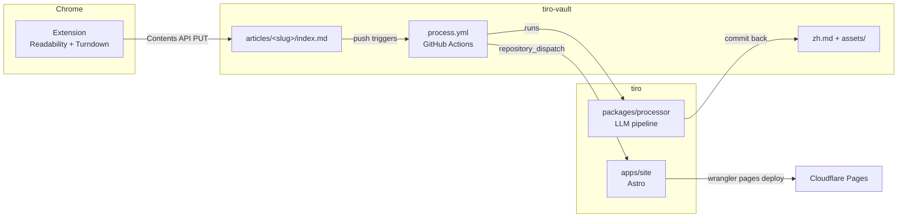

# Tiro Architecture

Tiro is a personal read-it-later tool and external knowledge base. Code lives in
this monorepo (`tiro`); content lives in a separate vault repo (`tiro-vault`).

## Data flow

1. **Clip.** The Chrome extension repairs the page DOM, extracts it
   (Readability), converts it to Markdown (Turndown), assembles frontmatter,
   and commits a single `index.md` into the vault via the GitHub Contents API.
   Images stay hotlinked (absolute URLs) at this stage.

   The repair pass (`apps/extension/src/dom-prepare.ts`) runs on a clone
   *before* Readability, which prunes low-text subtrees it cannot be asked to
   give back. It recovers each formula's LaTeX source (KaTeX/MathJax
   annotation, then arXiv's `<math alttext>`, then MathJax v2's
   `math/tex` script), deletes the visual duplicate, escapes literal dollars so
   the recovered delimiters are the only bare ones left, and records `has_math`;
   and it normalizes however the page marked up its code languages into the
   `language-*` class Turndown reads, dropping line-number gutters (ADR 0009).
   Figures are the exception, folded *after* extraction instead: a `<figure>`'s
   caption joins its image's paragraph, so the two arrive as one block and the
   site can render them as a figure — co-location is the only association
   markdown can express (ADR 0011). It has to run second because Readability
   selects on the very attributes folding replaces; done first, a
   `<figure hidden>` became a plain `
` and its hidden image was published.
2. **Process.** A push to `articles/**` triggers the vault's workflow, which
   checks out this repo and runs `tiro-process`:
   - detect language (CJK-codepoint ratio, no LLM call),
   - download images into `assets/` and rewrite body URLs to relative paths
     (per-image fallback to hotlink on failure),
   - one LLM call for a structured summary, one category (from the taxonomy in
     `config/tiro.yml`), and free-form tags, written into frontmatter,
   - for non-Chinese articles, a block-aligned Chinese translation → `zh.md`,
     batched and checkpointed so a long article resumes rather than restarts
     (ADR 0008),
   - commit results back and fire a `repository_dispatch` to this repo.

   Pending articles are processed cheapest-first, under a wall-clock budget
   (`processing.run_budget_ms`) the processor enforces itself so it stops in
   time to commit. Anything it does not reach stays pending for the next run.
3. **Publish.** The deploy workflow checks out both repos, builds the Astro
   site from the vault content, indexes it with Pagefind, and deploys to
   Cloudflare Pages. The site is fully public.

   Rendering is one unified pipeline (`apps/site/src/lib/render.ts`). Shiki
   and KaTeX run *after* rehype-sanitize, as trusted generators over
   already-scrubbed text, so the allowlist never has to admit the classes and
   inline styles they emit — which would admit them from clipped markup too
   (ADR 0009).

## The content contract

`packages/shared` is the single source of truth shared by all three
components: frontmatter schema (Zod), slug/path rules, block-alignment
helpers, and the `tiro.yml` config schema. Key invariants:

- **Slug is deterministic from the URL** (normalized URL → slugified
  host+path + 8-hex SHA-256 suffix). Articles live flat at
  `articles/<slug>/` (ADR 0007), so the path itself guarantees a re-clip
  overwrites the same article and reprocesses it.
- **Needs processing** = frontmatter lacks `tiro.processed_at`. Idempotent and
  retry-safe; no dependence on push diffs. Every translated article keeps a
  `.tiro-zh-cache.json` checkpoint beside it: an article too long for one run
  resumes from it (ADR 0008), and a finished one holds onto it so a later
  re-clip pays only for the blocks whose source text changed (ADR 0010). The
  checkpoint is invisible to every reader, which glob `index.md`/`zh.md` only.
- **Translation alignment**: `zh.md` has strict 1:1 top-level-block alignment
  with the `index.md` body (`code` and `math` blocks byte-identical). The site
  zips the two block arrays for side-by-side rendering; misalignment falls back
  to stacked rendering, and the processor never writes a misaligned `zh.md`.
  The shared parser runs remark-math, so `$$…$$` is a single `math` block even
  with blank lines inside, the way a fenced code block already is (ADR 0009).
- **Each article records what produced it**: `tiro.clipper_version` and
  `tiro.clipper_commit` alongside `tiro.processor_version`, all optional so
  articles predating any of them simply lack them. The version names a
  *release*; the commit — `git describe` output injected at build time, e.g.
  `ext-v0.11.0-8-gbe3dcc8` — names the *source* it was built from, which is the
  honest answer when the extension is loaded unpacked from a working tree
  rather than installed from a release. A `-dirty` suffix records that the tree
  differed from that commit without saying how, so two dirty builds off one
  commit are indistinguishable: it narrows an investigation rather than
  settling it. Answering "which clipper wrote this?" per article beats comparing
  `clipped_at` against the extension's git history, which is how the arXiv
  equation regression had to be traced. Note that both must be named on
  `ArticleFrontmatterSchema`, not just the clip schema: zod strips keys an
  object does not name, and the processor reparses and rewrites frontmatter on
  every run, so an unnamed field is deleted the first time an article is
  processed.
- **Math is declared, not guessed**: the optional `has_math` flag records that
  the clipper escaped every literal `$` in the article's prose, so every bare
  `$…$` left in it is a formula. Only those articles read `$…$` as a delimiter;
  everywhere else the site renders `$$…$$` alone, so prose dollar amounts are
  never mistaken for formulas. Only the clipper may set it — it is the one
  component that sees the DOM and can tell a price from a formula (ADR 0009).
- **LLM access is provider-configurable**: an OpenAI-compatible
  chat-completions endpoint configured in `config/tiro.yml` (`base_url`,
  `model`, `api_key_env`). Default: Aliyun Bailian + `qwen-plus`.

## Repositories and credentials

| Where | Secret / token | Purpose |
| --- | --- | --- |
| Extension options page | fine-grained PAT (tiro-vault, Contents RW) | clip commits |
| tiro-vault Actions | `TIRO_LLM_API_KEY` | LLM calls |
| tiro-vault Actions | `TIRO_DISPATCH_TOKEN` (tiro, Contents RW) | repository_dispatch |
| tiro Actions | `VAULT_READ_TOKEN` (tiro-vault, Contents R; only if vault is private) | deploy checkout |
| tiro Actions | `CLOUDFLARE_API_TOKEN`, `CLOUDFLARE_ACCOUNT_ID` | Pages deploy |

## Risk register

- **Silently empty Astro collection** when the vault path is wrong
  (withastro/astro#12795): the site asserts the vault dir exists and fails the
  build if the articles collection is empty.
- **`btoa` throws on non-Latin1** (Chinese titles): the extension encodes
  base64 via a chunked `TextEncoder` helper.
- **Readability returns `null`** on SPAs/paywalls: fall back to capturing
  `document.body` with a `readability_failed` frontmatter flag.
- **Hotlink-protected or oversized images**: per-image fallback to the
  original URL; an image failure never fails the article. Stage-wide caps
  (`images.max_count`, `total_max_bytes`, `stage_timeout_ms`) stop an
  image-heavy page from running the job past its `timeout-minutes`.
- **Contents API 1MB GET limit** breaks the sha lookup for very large clips:
  `findExistingIndex` is a single Contents GET, so re-clipping a page whose
  stored `index.md` exceeds 1MB fails the clip rather than overwriting. Not
  mitigated — a Markdown clip that large is not a case worth code. (A Git
  Trees fallback would be the fix if it ever happens.)
- **Workflow recursion**: pushes made with the default `GITHUB_TOKEN` do not
  retrigger workflows; the processing workflow also uses a concurrency group
  and rebase-retry pushes.
- **An article too long to process in one run**: translation is checkpointed
  per batch and the processor stops on its own budget with time left to commit,
  so successive runs converge instead of each restarting from batch 1
  (ADR 0008). `timeout-minutes` is a backstop above that budget, and the commit
  step runs `if: always()` so even a kill keeps the run's work. Ordering pending
  articles cheapest-first stops one such article from starving the rest.
- **Expiring fine-grained PATs** (two of them): documented in the
  vault-template README; set a calendar reminder.
- **Pagefind index only exists after a build**: the search UI degrades
  gracefully in `astro dev`.
- **Cloudflare Pages 25MB/file cap**: the asset copy step skips and warns on
  oversized files (the processor already caps downloads at 10MB).

## Decision log

See [`docs/adr/`](./adr/) for the individual decision records.
